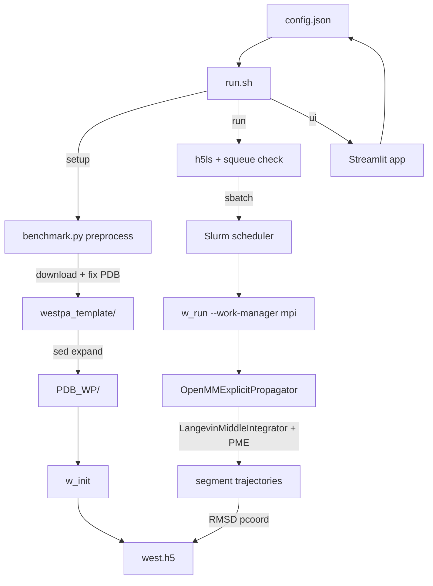

# NERSC Distributed Molecular Simulation

Repository: [cadenroberts/nersc-distributed-molecular-simulation](https://github.com/cadenroberts/nersc-distributed-molecular-simulation).

Distributed molecular simulation system for orchestrating WESTPA weighted ensemble sampling with OpenMM on GPU clusters. Automates PDB preprocessing, WESTPA workspace setup, Slurm job submission, and iteration monitoring across NERSC Perlmutter nodes.

Set `NDMS_CONFIG_DIR` to the directory containing `config.json` (legacy: `HELIXNET_CONFIG_DIR`).

## Files

| Path | Role |
|------|------|
| `benchmark.py` | CLI and Streamlit UI: config I/O, RCSB search, PDB preprocessing, SSH execution |
| `run.sh` | Shell orchestrator: setup, run, batch-setup, batch, ui, demo |
| `test.sh` | Test harness: local mock of Slurm flow, NERSC end-to-end |
| `config.example.json` | Example runtime config (paths, Slurm, WESTPA, OpenMM, preprocessing) |
| `requirements.txt` | Pip dependencies (Streamlit, Paramiko, Requests, Pytest, Responses) |
| `pytest.ini` | Pytest config and marker definitions |
| `.github/workflows/ci.yml` | GitHub Actions: conda install, syntax check, demo smoke test, pytest |
| `tests/test.py` | Unit and integration tests |
| `westpa_template/b.txt.template` | WESTPA basis state template |
| `westpa_template/env.sh.template` | HPC environment bootstrap template |
| `westpa_template/west.cfg.template` | WESTPA configuration template |
| `westpa_template/run.slurm.template` | Slurm batch script template |
| `westpa_template/openmm_explicit_rmsd_p_ca_propagator.py` | WESTPA/OpenMM propagator: explicit solvent, RMSD progress coordinate |

## Entry Points

| Command | Description |
|---------|-------------|
| `./run.sh setup <PDB_ID>` | Preprocess PDB, expand templates, initialize WESTPA workspace |
| `./run.sh run` | Scan `*_WP` dirs, submit/resubmit Slurm jobs until target iterations reached |
| `./run.sh batch-setup` | Setup all PDB IDs from `pdb_ids.json` that lack a workspace |
| `./run.sh batch` | batch-setup then run |
| `./run.sh ui` | Launch Streamlit UI (`benchmark.py`) |
| `./run.sh demo` | Local smoke test: preprocess 1L2Y, verify artifacts, cleanup |
| `./test.sh mock` | Mock Slurm/HDF5 environment, exercise `run.sh run` |
| `./test.sh e2e [PDB_ID]` | Full pipeline on NERSC via SSH |
| `python3 benchmark.py read-config <key>` | Print config value by dot path |
| `python3 benchmark.py preprocess <pdb_id>` | Run PDB preprocessing pipeline |

## Verification

```bash
bash -n run.sh test.sh
python -m pytest tests/test.py -v --tb=short
./run.sh demo
```

## Architecture



## License

MIT
